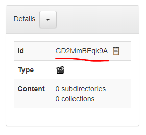

End result
----------

You'll end up with this:


Note: Varasto can also track the movies that you've watched (and which year) - see the "seen" tag.


Preparations
------------

You only have to do this part once.

Create a directory in Varasto, let's say `Media > Movies`.

Let's tell Varasto that this is a directory for storing movies. You don't necessarily have
to do this, but Varasto can be a bit smarter about displaying the contents if it knows exact
use for a directory.


Now you can see the assigned type. Take note of the directory's ID:




Uploading your first movie
--------------------------

NOTE: While this guide discusses command line usage, you can also upload files from the UI!

We have a directory that has a movie in it

```
$ cd ted2/
$ tree .
└── Ted 2 (2015).mkv
```

Remember, our movie parent directory ID is `GD2MmBEqk9A`.

To upload the movie to Varasto, do this:

```
$ sto adopt GD2MmBEqk9A && sto push
```

The upload is done! But let's break down the above two commands:

We'll adopt the directory in Varasto. Adopting means that a corresponding collection will
be created in Varasto under a specified Varasto directory (but no files will be
uploaded/pushed yet).

```
$ sto adopt GD2MmBEqk9A
```

Now we have an empty collection in Varasto:


Next we'll just push the contents of the directory to Varasto:

```
$ sto push
```

Removing the local copy that we just uploaded
---------------------------------------------

Varasto has a [safe mechanism for removing](../../data-interfaces/client/index.md) local
copies of collections - it only removes the data if Varasto server has the same data:

```console
$ cd ..
$ sto rm ted2
```


Fetching metadata
-----------------

The movie is stored in Varasto, but Varasto can't fetch metadata for it without telling
exactly which movie it is (Varasto is not yet smart enough to guess based on filename).

Go find the movie on IMDb, and copy-paste its ID to Varasto:


Sidenote: we'll soon might make a search that lets you search directly from Varasto.

Now set the ID and pull metadata. Also note that we had an ugly name for the directory
that we uploaded the movie from, but we can let Varasto clean up the collection's name
from the proper title in IMDb:


Metadata support
----------------

Like you saw in the end result, Varasto fetched metadata for the movie:

- Movie runtime
- Banner image
- Plot summary, revenue and release date
- Links to IMDb and TMDb

Varasto needs an API key to be able to fetch movie and TV show metadata.

You can do this from `Settings > Content metadata > TMDb`:


