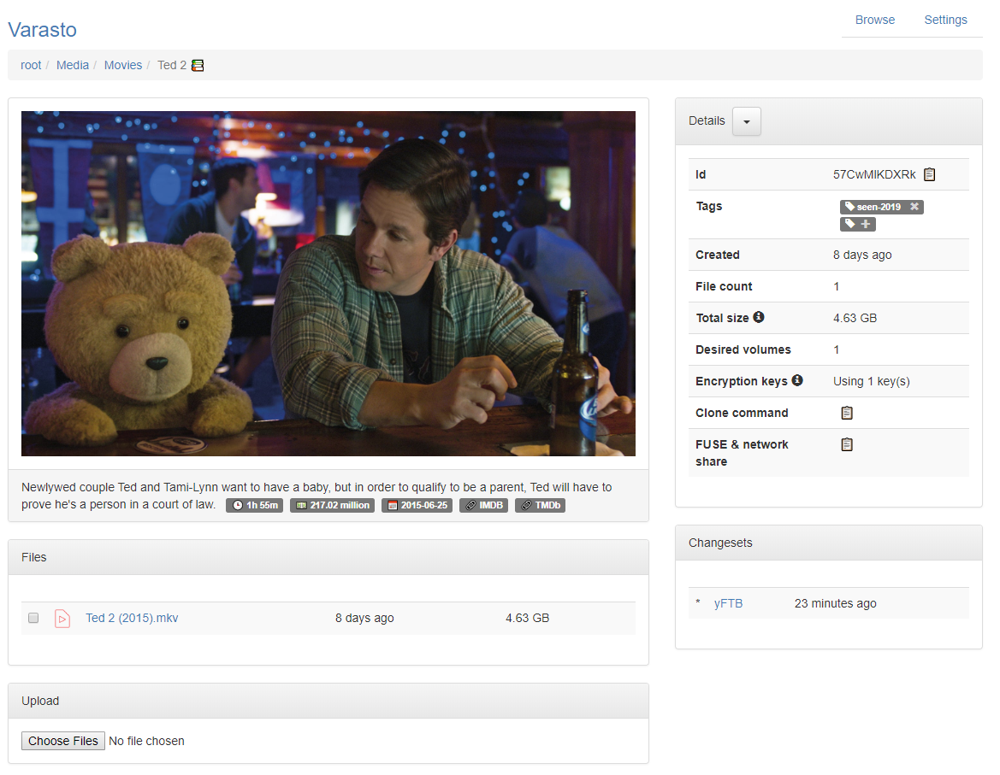
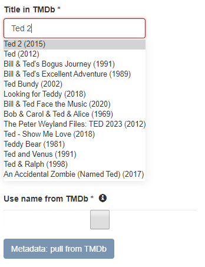

End result
----------

You'll end up with this:



Note: Varasto can also track the movies that you've watched (and which year) - see the "seen" tag.


Preparations
------------

!!! info
	You only have to do this part once.

Create a directory in Varasto, let's say `Media > Movies`.

Let's tell Varasto that this is a directory for storing movies. You don't necessarily have
to do this, but Varasto can be a bit smarter about displaying the contents if it knows exact
use for a directory.


Now you can see the assigned type. Take note of the directory's ID:


Uploading your first movie
--------------------------

!!! tip
	While this guide discusses command line usage, you can also upload files from the
	[Web UI](../../data-interfaces/web-ui/index.md)!

We have a directory that has a movie in it:

```console
$ cd ted2/
$ tree .
└── Ted 2 (2015).mkv
```

Remember, our movie parent directory ID is `GD2MmBEqk9A`.

To upload the movie to Varasto, run these commands:

```console
$ sto adopt GD2MmBEqk9A
$ sto push
```

The upload is done!

??? info "Explanation: adopt"
	We'll **adopt** the directory in Varasto. Adopting means that a corresponding collection will
	be created in Varasto under a specified Varasto parent directory (but no files will be
	uploaded/pushed yet).

	After running the command, we now have an empty collection in Varasto:

	

??? info "Explanation: push"
	The push command **pushes** the collection's local changes (= all data, since adoption
	created an empty collection) to Varasto server.


Removing the local copy that we just uploaded
---------------------------------------------

Varasto has a [safe mechanism for removing](../../data-interfaces/client/index.md) local
copies of collections - it only removes the data if Varasto server has the same data:

```console
$ cd ..
$ sto rm ted2
```


Fetching metadata
-----------------

Like you saw in the end result, Varasto fetched metadata for the movie:

- Movie runtime
- Banner image
- Plot summary, revenue and release date
- Links to IMDb and TMDb

The movie is stored in Varasto, but Varasto can't fetch metadata for it without telling
exactly which movie it is (Varasto is not yet smart enough to guess based on filename):



Varasto can also clean up your collection name based on the official title:

- After adoption our collection name was `ted2`.
- After metadata pull it was cleaned up to `Ted 2`.


Metadata support configuration
------------------------------

Varasto needs an API key to be able to fetch movie and TV show metadata.

You can do this from `Settings > Content metadata > TMDb`:


