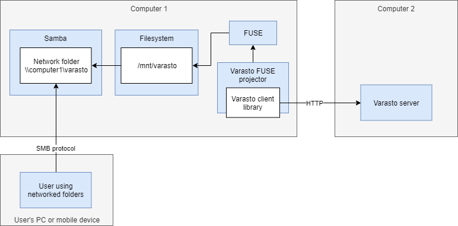

Motivation
----------

Varasto's web UI is good for quickly fetching a PDF file, looking at photos, watching
movies/videos or listening to music. But there are times when you just need to interact
with raw files.

For this use case, you could clone a collection to your computer and work with the files.
Cloning has one limitation: you need to download the files first. What if you just need
to access the raw files, but you'd prefer to stream them without downloading them to your
computer? That's what network folders are great for!

With Network folders, you can access/stream collections in Varasto as network folders and
files from any device - be it Windows, Linux or Mac computer or a mobile device.


OS limitations
--------------

| Component              | Linux | Mac | Windows | Android, iOS |
|------------------------|-------|-----|---------|--------------|
| Varasto server         | ☑    | ☑ | ☑      | ☐           |
| Access network folders | ☑    | ☑ | ☑      | ☑          |
| Varasto FUSE projector | ☑    | ☐  | ☐       | ☐           |

Currently you need Linux to share data from Varasto as network folders.


Architecture / how does it work?
--------------------------------

Varasto uses Linux-specific technology called
[FUSE](https://en.wikipedia.org/wiki/Filesystem_in_Userspace) to project content in Varasto
as a regular directory hierarchy that can be accessed from the local filesystem.

Note "local" - this directory hierarchy is only accessible on the computer the Varasto
FUSE projector runs on. But we can use Samba to export that directory hierarchy as network
share.

If you take a look at
[Varasto architecture](design_architecture-ideas-goals-inspired-by-comparison-to-similar-software.md)
drawing, you'll see that the FUSE interface is built on top of the Varasto client library,
which talks to the Varasto server over HTTP. That means that if you want, you can run the
FUSE projector on a different computer than where the Varasto server runs.

Focusing on network folders: Varasto FUSE projector + FUSE + Samba - here's how it could
look like with with separate computers for Varasto server and Varasto FUSE projector:



Even if you run server + projector on the same computer, this drawing is great for explaining
the components and their interactions.


Setting up FUSE projector on the same computer as Varasto server
----------------------------------------------------------------

Varasto can manage starting FUSE projector as a subsystem for you. Just go to settings,
and make sure the FUSE projector subsystem is started.

This feature is not yet completely ready - FUSE projector will crash if the client config
file is not present. Read the "different computer than Varasto server" section for details,
and you should read it anyway to gain more understanding.

If you're starting FUSE projector as a Varasto subsystem, you'll see the projector's logs
from Varasto's `Settings > Logs`.

If you're running Varasto in a Docker container, you need to bind mount the Varasto FUSE
mountpoint from host to your container so the Samba process can benefit from the FUSE mount.


Setting up FUSE projector on a different computer than Varasto server
---------------------------------------------------------------------

This section and process needs cleaning up to make it easier for all users.

Currently I only have a few short pointers for more technical users:

You need to decide where you want the Varasto filesystem mountpoint be placed. In the above
drawing it's `/mnt/varasto` but you can use anything you want. Run `$ mkdir /mnt/varasto`.

Since Varasto FUSE projector is a client, we need to configure how to connect to the server.
Your config would look about like this:

```
$ sto config-print
path: /home/joonas/varastoclient-config.json
{
	"server_addr": "https://localhost",
	"auth_token": "qZKcP...",
	"fuse_mount_path": "/mnt/varasto"
}
```

Note: `$ sto ...` commands unless prefixed with `$ sto server` are Varasto **client**
commands since you'll use the client more often.

You can run `$ sto config-init` to generate the config file.

For `auth_token` you need to create an API token in `Settings > Users`.

You need to run the projector manually by running `$ sto fuse serve`. TODO: systemd unit
file for automatically running it.


Testing that FUSE projector is working
--------------------------------------

Once you've started the FUSE projector, we should test that it works before moving on to
configure Samba.

FUSE projector works like this: if you have a collection with ID `bmnpli5QXgc`, it can be
accessed over fuse at `/mnt/varasto/id/bmnpli5QXgc`.

Find a collection from Varasto's web UI to test with, and `$ cd` into that. FUSE projector
dynamically fetches the latest revision of that collection. You should see its files now.

If the above works, it's time to set up Samba.


Setting up Samba
----------------

Varasto doesn't bundle a Samba server because you might already be running a Samba server
configured to your liking. And if you're using Varasto on Docker, it really goes against
containerization philosophy to run two different products inside one container.

If you already have a Samba server, all that's left is that you just configure it to
export `/mnt/varasto`.

If you're not running a Samba server:

- There's many good tutorials online for setting up Samba
- Or if you're using Docker, you could use my
[joonas-fi/samba](https://github.com/joonas-fi/samba) image that I use to export Varasto
and more.
