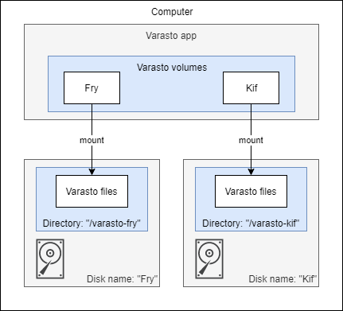

Setting up local disk storage
=============================

Contents:

- [Overview](#overview)
- [Which filesystem to store Varasto data on top of?](#which-filesystem-to-store-varasto-data-on-top-of)
- [Creating & mounting a volume](#creating---mounting-a-volume)
- [Choose a naming scheme for your volumes](#choose-a-naming-scheme-for-your-volumes)
- [Do I need a dedicated partition for Varasto volume?](#do-i-need-a-dedicated-partition-for-varasto-volume)
- [But is ext4 / NTFS safe for my precious data?](#but-is-ext4---ntfs-safe-for-my-precious-data)
- [More details for nerds](#more-details-for-nerds)
- [Why call it a volume and not a disk?](#why-call-it-a-volume-and-not-a-disk)


Conceptual overview
-------------------

Create one volume in Varasto for each disk you want to use with Varasto.




Which filesystem to store Varasto data on top of?
-------------------------------------------------

Varasto is not a filesystem in the traditional sense, even though it does very similar things.

Varasto's local disk storage works with any filesystem that your OS supports. Use ext4,
NTFS, etc. - whatever you like! Varasto only needs to write files and directories under a
directory that you choose - that's it.

For Linux we recommend ext4 and for Windows we recommend NTFS. Basically whichever
filesystem is the current safe choice without paying too much overhead with extra features.


Creating & mounting a volume
----------------------------

Create a volume in Varasto which is basically just its name and a quota. The UI has helpful tips.

I chose `Fry` for my volume name.

In this example I'm using Linux, and I have a dedicated partition at `/mnt/fry`.

We could have Varasto place its data at the root of the partition, but it's a good idea to
create a directory under which Varasto places its data, so that if/when any non-Varasto
files are placed on the partition, you know exactly which are Varasto's files.

To be super clear, I recommend naming the directory `varasto-<volume name>`:

```
$ mkdir /mnt/fry/varasto-fry
```

It's now an empty directory.

Now we are ready to mount that directory as volume in Varasto! From Varasto choose
`Fry > Mount local volume`. Enter the directory you created as path: `/mnt/fry/varasto-fry`.

That's it! Now that the volume is mounted, Varasto can write files there.


Choose a naming scheme for your volumes
---------------------------------------

Decide on a naming scheme for your volumes. Don't use "Movies" or "Music" because with
Varasto you don't need to stress about which disk is used for storing which type of data.
I.e. name your disks, not their content.

You can name your volumes anything you like - a few examples:

- Your favourite TV show characters (I used Futurama)
- "Disk A", "Disk B", ... etc.
- Disk serial number

If you only have one disk or don't have a lot of disks, don't worry about this and just
use anything you like. You can rename volumes later if your needs change.


Do I need a dedicated partition for Varasto volume?
---------------------------------------------------

No, but it's cleaner to dedicate a partition for a Varasto volume.

If you use the same partition for Varasto and other use, it's difficult to define the
quota you want for your Varasto data if you don't know in the long term how much space is
left for Varasto to actually use.

If you want to just test Varasto, by all means just make a directory for Varasto in your
existing partition and start testing! If you like it and want to keep using it, you can
easily move the data later to a separate partition/disk without reinstalling Varasto.


But is ext4 / NTFS safe for my precious data?
---------------------------------------------

There are "safer" alternatives for Linux like ZFS or Btrfs and for Windows ReFS. While you can
use those, we don't recommend them because they have overheads like:

- integrity verification
- configurable replication
- file compression
- and maybe even encryption

Varasto already implements these! You'd pay the overhead twice and get additional complexity
without gaining anything.


More details for nerds
----------------------

When Varasto mounts a volume for the first time, it writes the volume ID in a "volume descriptor" file:

```
$ tree /mnt/fry/varasto-fry
`-- 0
    `-- 00
        `-- 0000000000000000000000000000000000000000000000000
```

We can inspect its content:

```
$ cat /mnt/fry/varasto-fry/0/00/0000000000000000000000000000000000000000000000000
{
    "volume_uuid": "VaLnZHPzHaY"
}
```

This is the only file that Varasto writes there in un-encrypted form. This file is used
to ensure that you don't accidentally mount the wrong volume's files (which could have
disastrous consequences because that would mess up bookkeeping).

When I add content in Varasto, more files will appear in the above hierarchy. I'll add a
file *now*. Now let's observe:

```
$ tree /mnt/fry/varasto-fry
|-- 0
|   `-- 00
|       `-- 0000000000000000000000000000000000000000000000000
`-- p
    `-- g5
        `-- dt8hr0to76a4236tmtuaaer6qith92crjir214snsihdlfmu0
```

Each filename is a hash of its content (except the volume descriptor). This is known as a
[CAS (Content Addressable Storage)](https://en.wikipedia.org/wiki/Content-addressable_storage).
A CAS-based provides deduplication and integrity checking "for free".

This same CAS-concept is used for all Varasto volume drivers like cloud disks, but the some
details may vary (e.g. most cloud drivers tend not to require subdirectory structure as
they don't slow down if there are millions of files in a single directory).

The reason Varasto creates subdirectories is so that we won't end up having too many files
in any one directory.


Why call it a volume and not a disk?
------------------------------------

Volume is more accurate, consider this:

| Volume name  | Storage location                 |
|--------------|----------------------------------|
| Disk A       | Local disk A                     |
| Disk B       | Local disk B                     |
| Cloud        | example@gmail.com's Google Drive |

It would be weird calling the "Cloud" volume a disk, since it's a software service and
even under the covers Google actually stores your data into multiple disks so it'd still
be "a group of disks"..
