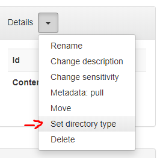

Guide: storing TV shows
=======================

Contents:

- [End result](#end-result)
- [Preparations](#preparations)
- [Preparing files for uploading](#preparing-files-for-uploading)
- [Uploading a single season](#uploading-a-single-season)
- [Uploading multiple seasons](#uploading-multiple-seasons)
- [Metadata support](#metadata-support)


End result
----------

It's better to show you the end result first, so this guide is easier to understand:


(note: with Varasto you can also keep track of the episodes you've seen - look at the
"seen" tag)


Preparations
------------

You will only need to do this once for Varasto.

Create a directory, let's say `Media > Series`.

Let's tell Varasto that this directory is used for storing TV series. This is not strictly
necessary, but it allows Varasto to be smarter on how it's going to display your content:



Now you can see the directory type: 📺


Preparing files for uploading
-----------------------------

Your TV episode files might be layed out in a single directory, so it's hard(er) for
Varasto to know that "these two files belong to episode 1, this one doesn't belong to
any episode", so we'll need to do some pre-processing to sort each episode in its own
directory.

In Varasto each independent group of related files (in this case a single TV episode - for
photos it could be a photo album with 100 pictures) should be its own collection.

Let's say you have directory with these season's episodes in:

```
$ tree .
.
├── S04E01.en.srt
├── S04E01.mkv
├── S04E02.en.srt
├── S04E02.mkv
├── S04E03.en.srt
├── S04E03.mkv
├── S04E04.en.srt
├── S04E04.mkv
├── S04E05.en.srt
├── S04E05.mkv
├── S04E06.en.srt
├── S04E06.mkv
├── S04E07.en.srt
├── S04E07.mkv
├── S04E08.en.srt
├── S04E08.mkv
├── S04E09.en.srt
├── S04E09.mkv
├── S04E10.en.srt
├── S04E10.mkv
├── S04E11-12.en.srt
├── S04E11-12.mkv
├── S04E13.mkv
├── S04E14.mkv
├── S04E15.mkv
├── S04E16.mkv
├── S04E17.mkv
├── S04E18.mkv
├── S04E19.mkv
├── S04E20.mkv
├── S04E21.en.srt
├── S04E21.mkv
├── S04E22.mkv
└── season04-poster.jpg
```

Let's sort them by season and episode. Varasto has `mvu` subcommand ("move utils" - think
the Unix "mv" command but for specific situations) to do this. But let's first do a **dry run**
to see what the command would do:

```
$ sto mvu tv
S04/S04E01 <= [S04E01.en.srt S04E01.mkv]
S04/S04E02 <= [S04E02.en.srt S04E02.mkv]
S04/S04E03 <= [S04E03.en.srt S04E03.mkv]
S04/S04E04 <= [S04E04.en.srt S04E04.mkv]
S04/S04E05 <= [S04E05.en.srt S04E05.mkv]
S04/S04E06 <= [S04E06.en.srt S04E06.mkv]
S04/S04E07 <= [S04E07.en.srt S04E07.mkv]
S04/S04E08 <= [S04E08.en.srt S04E08.mkv]
S04/S04E09 <= [S04E09.en.srt S04E09.mkv]
S04/S04E10 <= [S04E10.en.srt S04E10.mkv]
S04/S04E11 <= [S04E11-12.en.srt S04E11-12.mkv]
S04/S04E13 <= [S04E13.mkv]
S04/S04E14 <= [S04E14.mkv]
S04/S04E15 <= [S04E15.mkv]
S04/S04E16 <= [S04E16.mkv]
S04/S04E17 <= [S04E17.mkv]
S04/S04E18 <= [S04E18.mkv]
S04/S04E19 <= [S04E19.mkv]
S04/S04E20 <= [S04E20.mkv]
S04/S04E21 <= [S04E21.en.srt S04E21.mkv]
S04/S04E22 <= [S04E22.mkv]

DUNNO
-------
season04-poster.jpg
```

Some episodes have subtitles, some do not. There's also `season04-poster.jpg` which isn't
linked to any episode so TV renamer doesn't know what to do with it. This is fine - we don't
need or want any images related to the series, season or the episode anyways (Varasto fetches
those automatically for you).

Ok, let's run the command for real and check the file tree now:

```
$ sto mvu tv --do
$ tree .
.
├── S04
│   ├── S04E01
│   │   ├── S04E01.en.srt
│   │   └── S04E01.mkv
│   ├── S04E02
│   │   ├── S04E02.en.srt
│   │   └── S04E02.mkv
│   ├── S04E03
│   │   ├── S04E03.en.srt
│   │   └── S04E03.mkv
│   ├── S04E04
│   │   ├── S04E04.en.srt
│   │   └── S04E04.mkv
│   ├── S04E05
│   │   ├── S04E05.en.srt
│   │   └── S04E05.mkv
│   ├── S04E06
│   │   ├── S04E06.en.srt
│   │   └── S04E06.mkv
│   ├── S04E07
│   │   ├── S04E07.en.srt
│   │   └── S04E07.mkv
│   ├── S04E08
│   │   ├── S04E08.en.srt
│   │   └── S04E08.mkv
│   ├── S04E09
│   │   ├── S04E09.en.srt
│   │   └── S04E09.mkv
│   ├── S04E10
│   │   ├── S04E10.en.srt
│   │   └── S04E10.mkv
│   ├── S04E11
│   │   ├── S04E11-12.en.srt
│   │   └── S04E11-12.mkv
│   ├── S04E13
│   │   └── S04E13.mkv
│   ├── S04E14
│   │   └── S04E14.mkv
│   ├── S04E15
│   │   └── S04E15.mkv
│   ├── S04E16
│   │   └── S04E16.mkv
│   ├── S04E17
│   │   └── S04E17.mkv
│   ├── S04E18
│   │   └── S04E18.mkv
│   ├── S04E19
│   │   └── S04E19.mkv
│   ├── S04E20
│   │   └── S04E20.mkv
│   ├── S04E21
│   │   ├── S04E21.en.srt
│   │   └── S04E21.mkv
│   └── S04E22
│       └── S04E22.mkv
└── season04-poster.jpg
```


Uploading a single season
-------------------------

Ok create a directory in Varasto for this series. I created `Media > Series > Brooklyn Nine-Nine`.

Now let's tell Varasto exactly which TV series this is, fetch IMDb ID according to
[these instructions](guide_storing-movies.md#fetching-metadata), but instead of entering
it for a collection like with movies we enter the metadata ID for the main series directory
(Varasto will know that collections under this directory tree are for the same series):


Now observe that metadata is fetched! Now we need to create a directory for the season:


The directory's ID for me is `bkaPHC-pZoM`.

Now we want to upload each episode as own collection in that season's directory. You'll
just run this command:

```
$ cd S04/
$ sto push bulk --rm bkaPHC-pZoM | bash
```

Done - all your episodes are uploaded! Let's break down the above command!

The general form of the bulk command is `push bulk <parentDirectory>`.

The `--rm` switch removes the source files after they've been uploaded to Varasto. Don't
worry, the
[removal has safeguards](guide_storing-movies.md#removing-the-local-copy-that-we-just-uploaded)
which make it safe. If you don't want to remove the source files, leave out the switch.

The `bulk` command generates a small uploader shell script that will invoke `$ sto` commands
for each subdirectory to be uploaded as separate collection:

1. Adopt the episode's directory in Varasto
2. Push directory's contents to Varasto
3. (if wanted) Remove local source directory after upload is complete

To unpack the `| bash` portion a bit, this is equivalent:

```
$ sto push bulk --rm bkaPHC-pZoM > upload.sh
$ bash upload.sh
```

The upload.sh script looks like this:

```
set -eu

parentDirId="bkaPHC-pZoM"

one() {
	local dir="$1"

	(cd "$dir" && sto adopt -- "$parentDirId" && sto push)

	sto rm "$dir"
}

one "S04E01"
one "S04E02"
one "S04E03"
one "S04E04"
one "S04E05"
one "S04E06"
one "S04E07"
one "S04E08"
one "S04E09"
one "S04E10"
one "S04E11"
one "S04E13"
one "S04E14"
one "S04E15"
one "S04E16"
one "S04E17"
one "S04E18"
one "S04E19"
one "S04E20"
one "S04E21"
one "S04E22"
```

The script basically does this:

```
$ (cd S04E01/ && sto adopt "bkaPHC-pZoM" && sto push) && sto rm S04E01/
$ (cd S04E02/ && sto adopt "bkaPHC-pZoM" && sto push) && sto rm S04E02/
...
```


Uploading multiple seasons
--------------------------

We'll just leverage what we learned from uploading a single season. The general form is:

```
$ (cd S1/ && sto push bulk "idForSeason1" | bash)
$ (cd S2/ && sto push bulk "idForSeason2" | bash)
$ (cd S3/ && sto push bulk "idForSeason3" | bash)
...
```


Metadata support
----------------

Varasto needs an API key to be able to fetch TV show and movie metadata.
Instructions are [here](guide_storing-movies.md#metadata-support).

Fetching metadata currently happens by mass-selecting each collection and hitting
"Refresh metadata automatically". In the future this will happen automatically.
