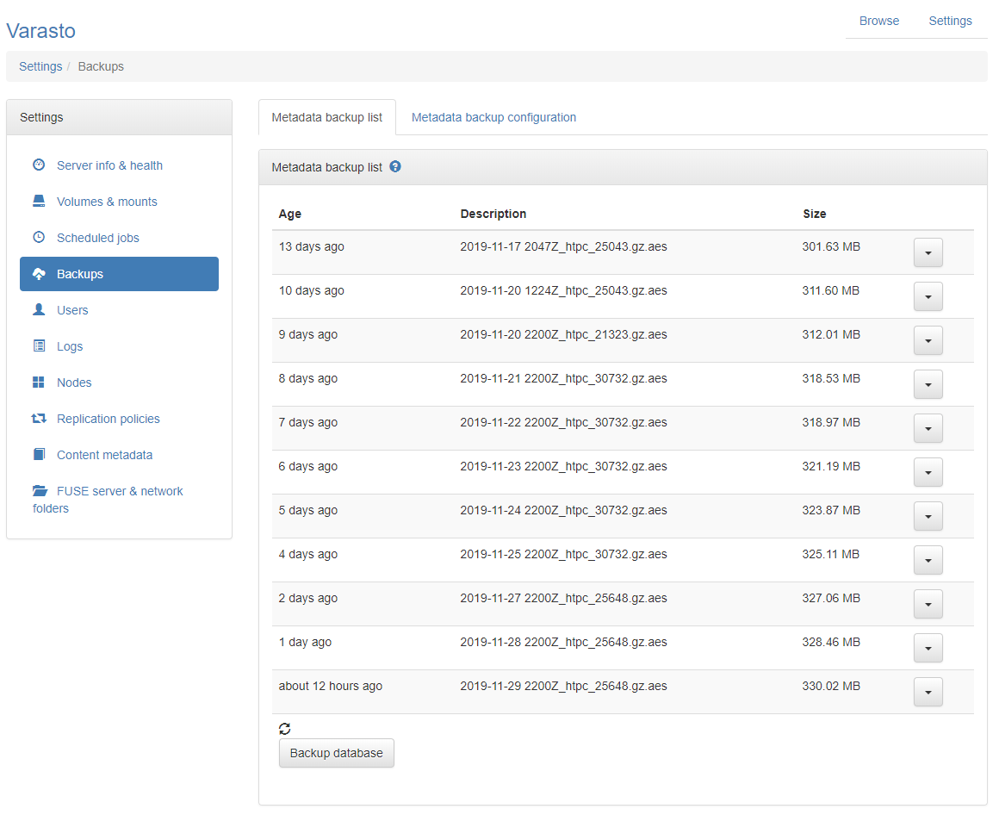

Metadata backup
===============

Contents:

- [Motivation](#motivation)
- [File backup vs metadata backup](#file-backup-vs-metadata-backup)
- [Setting up](#setting-up)
- [Automated backups](#automated-backups)
- [Taking a backup manually](#taking-a-backup-manually)
- [Restoring from backup, motivation for testing](#restoring-from-backup--motivation-for-testing)
- [Restoring from backup, instructions](#restoring-from-backup--instructions)
- [Using external backup program](#using-external-backup-program)


Motivation
----------

You don't want to lose any of your files/data.

Everything Varasto stores is encrypted on-disk, so if you lose the encryption keys you'll
lose the data forever. The encryption keys are stored in the metadata database in Varasto,
so backing it up is essential.

**If you don't back up your metadata database, you are OK with losing your files.**


File backup vs metadata backup
------------------------------

These are two different things. Varasto itself is file backup software insofar that you
can:

- recover old versions of files
- recover deleted files, and
- configure how many disks you'll want to replicate each file in.

In short, your files are automatically backed up provided that you've configured enough
redundancy for your acceptable risk level.

The metadata database is a different thing and is not automatically covered by redundancy -
backing up that metadata database is what we're talking about in this document.


Setting up
----------

Since this is so important, we've made it easy to back it up - Varasto has
[µbackup](https://github.com/function61/ubackup) built-in. The backup files are encrypted
so your backup hosting provider can't look at your metadata.

This support looks like this:



If you don't like µbackup or you want to use another backup program,
[that is also supported](#using-external-backup-program).

µbackup writes a copy of your metadata database in AWS S3. You'll want to back up in a remote
location to protect from fires or power surge events that could destroy your hardware.

To set up µbackup, you need:

- AWS account
- AWS S3 bucket (configuration is explained in µbackup docs)
- AWS credentials (access key id, secret access key)
- Public key for encryption

Look at µbackup docs for the public key generation (contents of file `backups.pub` in the docs).
That's the only detail you need from µbackup docs - the `backups.key` is the private key
portion of the public key, and you should keep the private key somewhere really safe -
preferably away from the machine that you run Varasto on. Technically, Varasto can't even
open the backup file after the backup is created.


Automated backups
-----------------

Backups are most effective if they're done frequently - this implies automation. Varasto
has scheduler that can automatically take these backups for you, and Varasto has built-in
monitoring for all scheduled tasks.

It's fine to use Varasto during backing up, since the underlying database uses
[MVCC](https://en.wikipedia.org/wiki/Multiversion_concurrency_control).


Taking a backup manually
------------------------

Sometimes you'll migrate servers or want to try something risky. There's also a button that
let's you take a backup **now** (look at the screenshot).


Restoring from backup, motivation for testing
---------------------------------------------

> "Nobody wants backup, they only want restore."

i.e. backups are useless unless you can use them to restore data. That's why you should
periodically test restoring your backups to verify that they work.

> "Schrodinger Backups: The condition of any backup is unknown until a restore is attempted"


Restoring from backup, instructions
-----------------------------------

µbackup has instructions on how to obtain the backup file. Make sure you decrypt the backup
file before trying to import the backup file.

To restore a database, run:

```
$ sto server dbimport < backupfile
```


Using external backup program
-----------------------------

If you don't want to use the built-in µbackup, here's instructions on what you can do.

The entire metadata database is in file `varasto.db`. You could back that file up, but
you would need to use OS-level filesystem snapshotting to even get a crash-consistent backup.
Crash-consistency means that it's similar to what would happen if a power went off from the
computer at that exact timestamp.

Databases generally can properly recover from crashes because they're designed to do their
best not to lose data. Varasto internally uses BoltDB which uses journaling so you're
probably OK with crash-consistent backups.

But for getting a totally consistent export of the metadata DB, we have an interface for
external backup programs as well.

You can get a consistent metadata DB backup from the following REST endpoint:

```
$ curl -H 'Authorization: Bearer ...' https://localhost/api_v2/database/export > export.log
```

You can get a bearer token by visiting `Settings > Users` and creating a new API key.
`Backup program` would be a descriptive name for the key.

Summary of your options:

| Option                                            | Description           |
|---------------------------------------------------|-----------------------|
| Just copy `varasto.db`                            | Dangerous             |
| Filesystem-level snapshot, then copy `varasto.db` | You'll probably be OK |
| Consistent snapshot from API                      | Safest option         |
