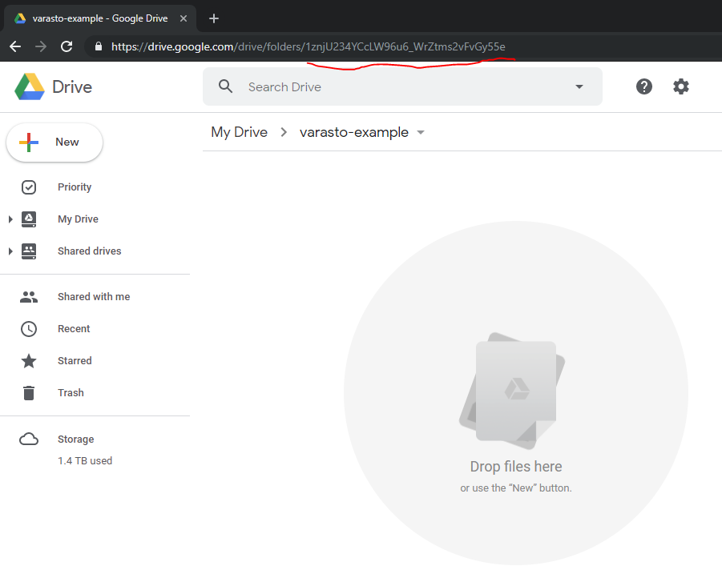
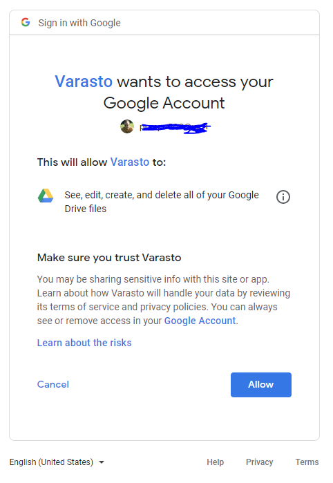

Overview
--------

When you mount Google Drive (or G Suite) volume in Varasto, you'll be asked for these details:

- Drive folder ID

- Client ID & client secret

- Authorization code

This document covers how we obtain these values.

Which GDrive folder to store Varasto blobs in?
----------------------------------------------

!!! danger "Important! Read carefully"
	Google recently added a limitation of 500 k files / folder (for non-root directories),
	[when previously there was no limitation](https://stackoverflow.com/a/62520242).

	Therefore we **recommend not creating a directory** and using GDrive root to store
	your blobs (which can have unlimited files).

	This has the unfortunate side effect of having blobs and regular files in same
	directory if you store non-Varasto files in your Google Drive. We'll investigate using
	nested subdirectories for blobs, but that has to be carefully thought out (creating
		dirs on-demand could yield in race conditions in clustered setups if not done
		correctly).

=== "I'll use GDrive root for blobs"

	For `Drive folder ID` specify `root` (literally, "root" is an ID alias)

=== "Use subdirectory for blobs (DANGEROUS)"

	Varasto stores all your blobs in Drive inside one folder - let's create it now.

	If you named your volume `Example`, I recommend you name your folder in Drive
	`varasto-example` for clarity (the name is technically arbitrary).

	Open the folder to discover its ID from URL:

	

	For my `Drive folder ID` I specified `1znjU234YCcLW96u6_WrZtms2vFvGy55e`

Create an API app in Google developers
--------------------------------------

Unfortunately, Google has not done this super easy.. First we need to define an "application"
at Google's side that "owns" the user credentials you'll access your Drive files with.

We'll start by doing rougly what
[Enable the Google Drive API](https://developers.google.com/drive/api/v3/enable-drive-api)
outlines. Do this in [Google APIs](https://console.developers.google.com/apis/):

- Create new project (or use a default project that there exists if you prefer), maybe good
  name is `Varasto-Google Drive`.

- Enable the `Google Drive API`

Under the `Project > Credentials`, we need to configure `OAuth consent screen`:

- User type = `Internal`

- Application name = `Varasto` (this is arbitrary name, but it's good to be clear)

- No other details are needed - press `[ Save ]`

Next, we need to create credentials for the **project** (these are not user credentials yet).
Again at `Project > Credentials`:

- `Create credentials > OAuth client ID`

- Application type = `Other`. Name = `Varasto`.

You'll now have `Client ID` and `Client secret`. Paste these into Varasto.

Authorization code
------------------

When you've entered folder ID, client id+secret in Varasto, you'll be redirected to Google
to authorize the API app that you just created to access Drive files on the user's behalf:

After allowing, you'll receive an authorization code that you'll paste back to Varasto.
You're now done. 🎉
