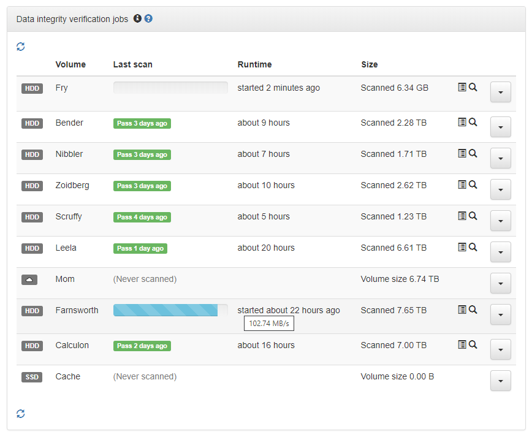

Description
-----------

In addition to verifying content hashes on file reads "in realtime", we also have background
jobs for verifying integrity of entire volumes' files - also known as
["scrubbing"](https://en.wikipedia.org/wiki/Data_scrubbing#File_systems).

Varasto can scan through your volumes to verify that all the replicas are healthy, and
raise an alert if any [bit rot](https://en.wikipedia.org/wiki/Data_degradation) or I/O
errors are detected.

Which errors can we detect?
---------------------------

Traditionally, filesystems without content integrity verification have trusted on the hard
drive to report I/O errors and bit rot. That's a risky strategy because hard drives can lie.

We use
[Content-Addressable Storage](../../concepts-ideas-architecture/index.md#content-addressable-storage)
to detect errors even if the hard drive would try to lie to us, so errors won't go undetected:

| Error type              | Detected by OS | Detected by Varasto |
|-------------------------|----------------|---------------------|
| Drive reports I/O error | ☑️ | ☑️ |
| Drive reports bit rot error | ☑️ | ☑️ |
| Drive lies about bit rot or I/O error | ☐ | ☑️ |
| An attacker tampers with your file | ☐ | ☑️ |

Pause / resume
--------------

These scans can be very long operations, when you have terabytes of data to plow through.
You can pause/resume scans if you need release some throughput or restart Varasto server
or the computer. Scanning jobs are also resilient to crashes - no need to start all over.

!!! bug "TODO"
	We should support running the scanning operation with a lower I/O priority so the scans
	have the least chance of disturbing anything.

	[Issue #89](https://github.com/function61/varasto/issues/89)

Scheduling
----------

!!! bug "TODO"
	We only support manually starting these scanning jobs - no automatic scheduling of them yet.

What if I encounter an error?
-----------------------------

If your data has silently corrupted on-disk, or if the disk gives I/O errors, the safest
option is to remove the drive and replace it with a new one. We have
[instructions for this](../when-a-disk-fails/index.md).

If you're unwilling to spend money, you can try to find out how serious the problem is and
if there's some hope, keep using it at your own risk - but please keep
[enough replicas](../replication-policies/index.md), follow the
[SMART diagnostics](../smart-monitoring/index.md) and prepare for the drive failing.

How does this work with encryption?
-----------------------------------

We have tricks to enable integrity verification without having access to the encryption
keys. Read more in
[encryption documentation](../../security/encryption/index.md#how-does-integrity-verification-work-with-encrypted-content).
