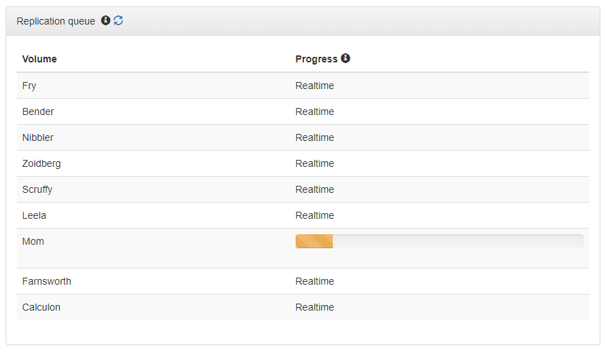

The problem
------------

Scenario: you're transferring large amounts of files from your computer to another disk or
cloud storage.

The transfer errors in the middle - either:

- your device crashes
- internet goes down
- the service has a hickup

You're now in a situation where you have to figure out which directories:

- transferred fully
- transferred partially
- did not transfer at all

.. then having to come up with a plan on how to continue from there. Ugh.

The solution
------------

Varasto's design really fits this use case because it has an asynchronous
**replication queue** (one per volume) where all data transfers are (atomically) queued
and the queue workers are resilient to temporary errors and software/hardware crashes.

Example case of moving data
---------------------------

!!! warning "Required reading"
	You should be familiar with [replication policies](../replication-policies/index.md) first.

Let's say that you have only on your local disk (named `Volume A`) this content:

- 20 TB of movies and TV series
- 500 GB of work files
- 500 GB of miscellaneous files

You now decide that you want to backup of all of this content into your cloud storage.
The cloud storage is empty in the beginning, so you've got 21 TB of data to transfer.

Before deciding you need a cloud backup, here's your replication policies:

| Name    | New data goes to |
|---------|------------------|
| Default | Volume A         |

**We'll transfer data by making changes to replication policies.**

??? info "Screenshot of replication policies UI"
	

### No need for prioritization

If you don't need to prioritize sending the data, you can just change the above policy to:

| Name    | New data goes to |
|---------|------------------|
| Default | Volume A, Cloud  |

Varasto's replication reconciliation process will notice that there are conflicts (with
how you want things to be vs. how they currently are), **confirm them with you** and will
start replicating the data.

You're done. You just need to wait for the queue backlog to reach realtime.

??? help "Explain the conflict resolution"
	Since the policy's **desired replica count** (derived from `New data goes to`) applies to
	existing data as well (not just new data - but new data will be written with policy
	compliance) and you just changed the policy, reconciliation process finds policy
	conflicts with your existing data:

	| Policy change | Policy's replica count | Existing data's replica count | Conflict |
	|--------|----------|---|---|
	| Before | 1 | 1 | ☐ |
	| After  | 2 | 1 | ☑ |

### Using prioritization

If you want your data to be both in `Volume A, Cloud`, but you want to transfer your data
in prioritized batches, you could create a temporary "better policy" which you slowly
extend to cover more directories until it covers everything.

You create a new policy - here's your policies now:

| Name                 | New data goes to |
|----------------------|------------------|
| Default              | Volume A         |
| Increased resiliency | Volume A, Cloud  |

Here's the content in order of importance (= step order):

1. Work files
2. Everything else that is not movies or TV series
3. Movies
4. TV series

We'll do these steps:

=== "Starting situation"

	| Directory     | Policy, explicit     | Policy, inherited    | Cloud |
	|---------------|----------------------|----------------------|-------|
	| /             | Default              | Default              | ☐ |
	| /media/movies |                      | Default              | ☐ |
	| /media/series |                      | Default              | ☐ |
	| /work         |                      | Default              | ☐ |
	| /misc         |                      | Default              | ☐ |

=== "Step 1"

	| Directory     | Policy, explicit     | Policy, inherited    | Cloud |
	|---------------|----------------------|----------------------|-------|
	| /             | Default              | Default              | ☐ |
	| /media/movies |                      | Default              | ☐ |
	| /media/series |                      | Default              | ☐ |
	| /work         | Increased resiliency | Increased resiliency | ☑ |
	| /misc         |                      | Default              | ☐ |

	What you did:

	- Assign `Increased resiliency` to `/work`

	Effect:

	- Work files will be transferred

=== "Step 2"

	| Directory     | Policy, explicit     | Policy, inherited    | Cloud |
	|---------------|----------------------|----------------------|-------|
	| /             | Increased resiliency | Increased resiliency | ☑ |
	| /media/movies | Default              | Default              | ☐ |
	| /media/series | Default              | Default              | ☐ |
	| /work         |                      | Increased resiliency | ☑ |
	| /misc         |                      | Increased resiliency | ☑ |

	What you did:

	- Assign `Increased resiliency` to root
	- Assign `Default` to `/media/movies`
	- Assign `Default` to `/media/series`
	- Remove `Increased resiliency` from `/work`
		* No effect but it'd be now an redundant exception

	Effect:

	- **Everything else** except movies & TV series will be transferred

=== "Step 3"

	| Directory     | Policy, explicit     | Policy, inherited    | Cloud |
	|---------------|----------------------|----------------------|-------|
	| /             | Increased resiliency | Increased resiliency | ☑ |
	| /media/movies |                      | Increased resiliency | ☑ |
	| /media/series | Default              | Default              | ☐ |
	| /work         |                      | Increased resiliency | ☑ |
	| /misc         |                      | Increased resiliency | ☑ |

	What you did:

	- Remove `Default` from `/media/movies` (it'll now inherit root policy)

	Effect:

	- Movies will be transferred

=== "Step 4"

	| Directory     | Policy, explicit     | Policy, inherited    | Cloud |
	|---------------|----------------------|----------------------|-------|
	| /             | Increased resiliency | Increased resiliency | ☑ |
	| /media/movies |                      | Increased resiliency | ☑ |
	| /media/series |                      | Increased resiliency | ☑ |
	| /work         |                      | Increased resiliency | ☑ |
	| /misc         |                      | Increased resiliency | ☑ |

	What you did:

	- Remove `Default` from `/media/series` (it'll now inherit root policy)

	Effect:

	- TV series will be transferred

	After the transfer is done, all your content exists locally and in the cloud, and all
	new content will be automatically also written to in realtime.

	!!! tip
		Now, optionally, delete the old `Default` policy (clearly, it's no longer the default)
		and rename `Increased resiliency` to be the new `Default`.
